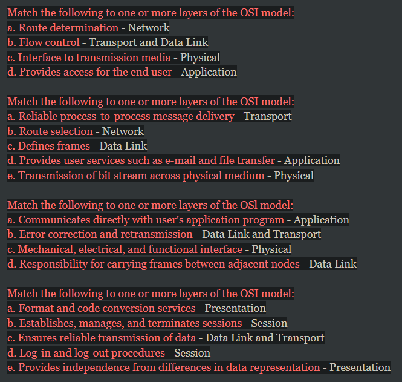
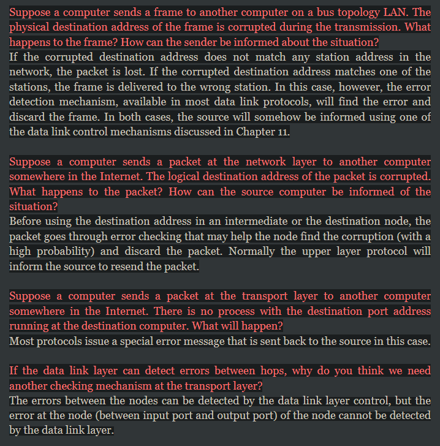
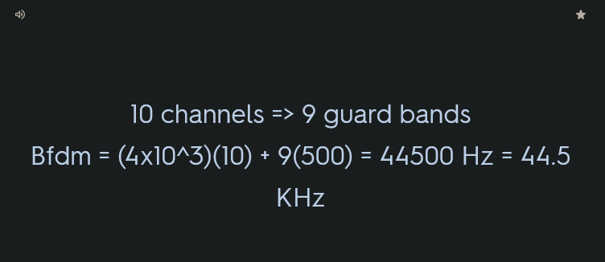
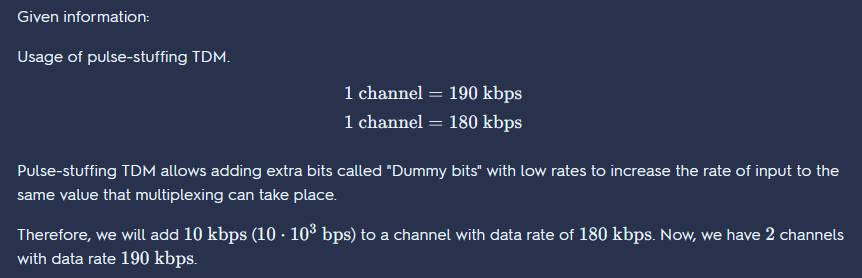
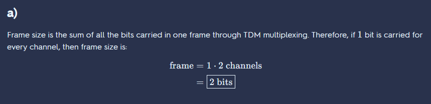
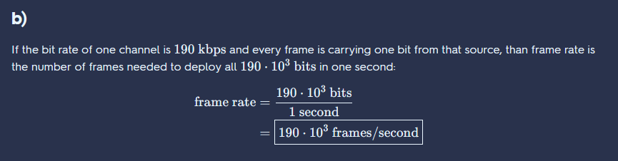
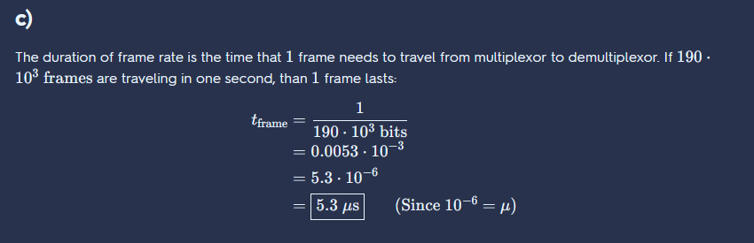
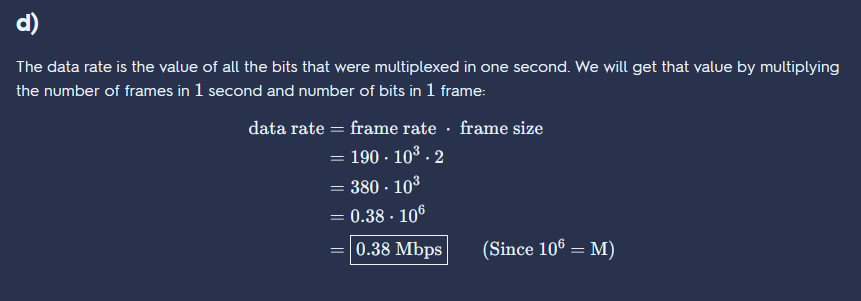

# Assignment

## 1. Design your own layered architecture for computer network

uwu

1. **Physical Layer**
2. **Data Link Layer**
3. **Network Layer**
4. **Transport Layer**
5. **Application Layer**

Layer 1: Physical Layer

- responsible for the transmission of raw data bits over a physical medium.
- defines electrical, mechanical, and procedural specifications for the physical connection between devices.
- ensures that data is properly transmitted between devices.

Key Functions:

- Bit transmission and reception
- Signal encoding and decoding
- Physical medium (e.g., copper wire, fiber optics) and connector specifications
- Modulation and demodulation

Layer 2: Data Link Layer

- responsible for ensuring reliable and error-free communication between devices on the same network.
- organizes the raw bits from the Physical Layer into data frames and performs error detection and correction.

Key Functions:

- Framing
- Error control (e.g., CRC, checksum)
- Flow control
- Media access control (MAC) addressing
- Link management

Layer 3: Network Layer

- responsible for routing data packets between devices on different networks.
- manages the logical addressing and path selection for data transmission.

Key Functions:

- Logical addressing (e.g., IP addresses)
- Routing and forwarding
- Network topology discovery
- Congestion control
- Quality of service (QoS) management

Layer 4: Transport Layer

- responsible for ensuring end-to-end communication between applications on different devices.
- guarantees reliable and ordered data delivery, manages flow control, and provides error checking.

Key Functions:

- Connection establishment, maintenance, and termination
- Reliable and ordered data transfer
- Flow control
- Error detection and correction
- Multiplexing and demultiplexing

Layer 5: Application Layer

- topmost layer in the architecture
- provides the interface between the user's application and the network.
- defines protocols and services that applications use to communicate over the network.

Key Functions:

- Application-specific protocols (e.g., HTTP, FTP, SMTP)
- User authentication and authorization
- Data formatting and presentation
- Application-level error handling
- Service discovery

This 5-layer architecture is designed to provide a modular and flexible framework for building computer networks. Each layer has a specific set of responsibilities and interacts with adjacent layers to ensure seamless data transmission across the network.

## 2. What is the difference between network layer delivery and transport layer delivery?

Network layer delivery and transport layer delivery are two different approaches to transmitting data between devices on a computer network.

NET

- The network layer is responsible for logical addressing and routing packets from a source host to a destination host through multiple network devices.
- The most common protocol used at the network layer is the Internet Protocol (IP).
- Network layer delivery involves breaking down data into smaller packets and sending them across the network to their destination via routers.
- This process makes sure that packets take the most efficient route possible to reach their destination, regardless of the physical location of the devices.

TRANS

- transport layer delivery involves ensuring the reliable transmission of data between end-to-end devices.
- Transport layer protocols, such as Transmission Control Protocol (TCP) and User Datagram Protocol (UDP), verify that data is delivered completely and reliably in the correct order.
- This layer also manages flow control and error recovery mechanisms to ensure data integrity.

In summary, the network layer focuses on routing data to its destination through the network, while the transport layer is responsible for ensuring data reliability and integrity between endpoints.

## 3. Why is there a need to support multi-level addressing?

There are several reasons to support multi-level addressing in computer networks:

1. Scalability:

- With multi-level addressing, it is possible to create a large number of unique network addresses.
- This allows for a larger number of devices to be connected to the network without running out of available addresses.

1. Flexibility:

- Multi-level addressing supports hierarchical network structures.
- This makes it easier to manage larger networks.
- Network administrators can divide the network into different subnets and allocate IP addresses at each level accordingly.

1. Improved network management:

- Multi-level addressing simplifies network management by providing a structured and organized approach to allocating IP addresses.
- Network administrators can easily add or remove subnets as required without disrupting the network.

1. Security:

- Multi-level addressing can be used to create secure zones within the network.
- By dividing the network into subnets and using different address ranges for each subnet, any security breaches are more contained and easier to manage.

Overall, supporting multi-level addressing is essential for creating a scalable, flexible, and manageable network infrastructure with improved security.

## 4. What are two reasons for using layered protocols?

1. Modularization: By dividing the network protocols into separate layers, each layer can be designed, implemented, maintained, and modified independently. The modular architecture makes it easier to divide and conquer the complexity of the network, enabling easier updates, and fixes.

2. Abstraction: Each separate layer encapsulates a specific task or group of related tasks. Abstraction is the process by which complex systems are separated into simpler components, allowing easier control and understanding. Abstraction also means that problems in one layer can be solved without affecting other layers.

3. Simplified Troubleshooting: Layered protocols also make troubleshooting easier by isolating problems to specific layers, thereby reducing the time needed to identify and fix issues. If an issue occurs at a certain layer, only that layer needs to be debugged without affecting other layers.

4. Standardization - Layered protocols make it possible for multiple vendors and devices to communicate using a common set of rules and procedures. These standards ensure that devices from different manufacturers can interoperate and communicate effectively. Standardization also makes it easier to write software and applications that can work on multiple network devices and platforms.

## 5. What are the responsibilities of the data link layer in the Internet model?

In the Internet model, the data link layer has the following responsibilities:

1. Framing: This is the process of dividing the data from the network layer into frames, which are smaller units of data that can be transmitted over the physical medium.

2. Error Control: The data link layer provides mechanisms for detecting and correcting errors that occur during transmission.

3. Media Access Control: The data link layer controls access to the network medium to ensure that only one device at a time can transmit data.

4. Flow Control: The data link layer regulates the flow of data between devices to prevent overwhelming the destination with too much data at once.

5. Addressing: The data link layer assigns unique addresses to devices on the network to enable efficient routing of data packets.

Overall, the data link layer is responsible for ensuring the reliable and efficient transmission of data over the network medium.

## 6. What are the responsibilities of the network layer in the Internet model?

The responsibilities of the network layer in the Internet model are as follows:

1. Logical addressing: The network layer defines a unique logical address, known as an IP address, that identifies each device on the network.

2. Routing: The network layer is responsible for determining the best path for data to travel from the source device to the destination device through a network of interconnected devices. This involves selecting the shortest or most efficient path based on the current network conditions.

3. Packet forwarding: The network layer is responsible for forwarding packets received from the transport layer to the appropriate interface on the next-hop device, based on the logical address of the destination device.

4. Fragmentation and reassembly: The network layer may fragment large packets into smaller packets that can be transmitted across the network, and is responsible for reassembling them at the destination device.

5. Quality of Service (QoS): The network layer may provide mechanisms for prioritizing certain types of traffic or ensuring a minimum level of service, such as an appropriate level of bandwidth or low latency, for certain applications or users.

## 7. What is the difference between a port address, a logical address, and a physical address?

A port address is a number that is used to identify a specific process that is running on a host computer. For example, if a user wants to connect to a particular web server, he/she needs to know the port number of the web server.

A logical address is a network address that is assigned to a device to identify it on a network. The most common type of logical address is an IP address, which is a unique identifier assigned to each device connected to the internet.

A physical address is the unique identifier assigned to a network interface card (NIC), which is the hardware component that enables a device to connect to a network. The physical address is also known as a MAC (Media Access Control) address and is used at the data link layer of the networking hierarchy.

## NOTE: 8-12 are on <https://www.thedailyprogrammer.com/2015/10/data-communications-and-networking-2.html>

## 8. Match the following to one or more layers of the OSI model

a) Route determination  
b) Flow control  
c) Interface to transmission media  
d) Provides access for the end user  

## 9. Match the following to one or more layers of the OSI model

a) Reliable process-to-process message delivery  
b) Route selection  
c) Defines frames  
d) Provides user services such as e-mail and file transfer  
e) Transmission of bit stream across physical medium  
f) Communicates directly with user's application program  
g) Error correction and retransmission  
h) Mechanical, electrical, and functional interface  
i) Responsibility for carrying frames between adjacent nodes.  



## 10. Suppose a computer sends a frame to another computer on a bus topology LAN. The physical destination address of the frame is corrupted during the transmission. What happens to the frame? How can the sender be informed about the situation?

## 11. Suppose a computer sends a packet at the network layer to another computer somewhere in the Internet. The logical destination address of the packet is corrupted. What happens to the packet? How can the source computer be informed of the situation?

## 12. If the data link layer can detect errors between hops, why do you think we need another checking mechanism at the transport layer?



## 13. Give some advantages and disadvantages of combining the session, presentation and application layer in the OSI model into one single application layer in the Internet model

ADVANTAGES OF COMBINING THE SESSION, PRESENTATION, AND APPLICATIONLAYER

- It’s simple to use
- You only have a single layer to study, because all the functions are provided by thatlayer.
- Functionality is performed by just one layer and it reduces the work for the other two layers.
- By combining the three layers you reduce the number of layers and increase the bandwidth for your network.
- It reflects the real-life separation of application from the TCP-downward sections ofthe OSI model.

DISADVANTAGES OF COMBINING THE SESSION, PRESENTATION, ANDAPPLICATION LAYER

- It becomes less reliable because by combining all three sessions it becomes harder for them to use the same code.
- It becomes harder to maintain because without clear separation of the layer and combining different layer functionality can lead to the code being toocomplex.
- The architecture of the network system becomes less effective.
- Trouble shooting becomes more difficult because the error might be in a singleplace.
- Because the Application security and network security will open in a single point it may cause security issues and expose the network to threats.

## 14. Consider sending a packet from a source host to a destination host over a fixed route. List the delay components in the end-to-end delay. Which of these delays are constant and which are variable?

## 15. Visit the Transmission Versus Propagation Delay applet at the companion Web site. Among the rates, propagation delay, and packet sizes available, find a combination for which the sender finishes transmitting before the first bit of the packet reaches the receiver. Find another combination for which the first bit of the packet reaches the receiver before the sender finishes transmitting

## 16. How long does it take a packet of length 1,000 bytes to propagate over a link of distance 2,500 km, propagation speed 2.5 x 108 m/s, and transmission rate 2 Mbps? More generally, how long does it take a packet of length L to propagate over a link of distance d, propagation speed s, and transmission rate R bps? Does this delay depend on packet length? Does this delay depend on transmission rate?

## 17. Suppose Host A wants to send a large file to Host B. The path from Host A to Host B has three  links, of rates R1 = 500 kbps, R2 = 2 Mbps, and R3 = 1 Mbps.  a. Assuming no other traffic in the network, what is the throughput for the file transfer?  b. Suppose the file is 4 million bytes. Dividing the file size by the throughput, roughly how  long will it take to transfer the file to Host B?  c. Repeat (a) and (b), but now with R2 reduced to 100 kbps

## 18. Suppose end system A wants to send a large file to end system B. At a very high level, describe how end system A creates packets from the file. When one of these packets arrives to a packet switch, what information in the packet does the switch use to determine the link onto which the packet is forwarded? Why is packet switching in the Internet analogous to driving from one city to another and asking directions along the way?

IN KUROSE 7th Edition Unit 1 Review 16-20

## 19. We need to use synchronous TDM and combine 20 digital sources, each of 100 Kbps. Each output slot carries 1 bit from each digital source, but one extra bit is added to each frame for synchronization. Answer the following questions

a. What is the size of an output frame in bits?  
b. What is the output frame rate?  
c. What is the duration of an output frame?  
d. What is the output data rate?  
e. What is the efficiency of the system (ratio of useful bits to the total bits).  

a)

Given data:

The total number of digital sources=20

Each frame output slot carries 1 bit from each digital source, but one extra bit is added to each frame for synchronization.

Then, the size of the an output frame in bits = 20×1+1

= 21 bits

b)

Each frame carries 1 bit from each source.

Then, the frame rate=100Kbps

=100,000 frames/s

c)

The duration of an output frame=1/frame rate

=1/100000

=10us

d)

Output data rate= size of an output frame×frame rate

= (100000 frames/s)×(21 bits/frame)

=21× 10⁵ bits/s

=2.1×10⁶ bits/s

=2.1 Mbps (since, 1Mbps=106bits/s)

e)

In each frame 20 digital sources out of 21 are useful.

Therefore, the efficiency of the system=20/21

=95%

## 20. Assume that a voice channel occupies a bandwidth of 4 kHz. We need to multiplex 10 voice channels with guard bands of 500 Hz using FDM. Calculate the required bandwidth



## 21. Two channels, one with a bit rate of 190 kbps and another with a bit rate of 180 kbps, are to be multiplexed using pulse stuffing TDM with no synchronization bits. Answer the following questions

a. What is the size of a frame in bits?  
b. What is the frame rate?  
c. What is the duration of a frame?  
d. What is the data rate?  







## 22, 23, 24 and 25

```text
Q22. An HTTP GET message (i.e., this is the actual content of an HTTP GET message). The characters
<cr><lf> are carriage return and line-feed characters (that is, the italized character string <cr> in
the text below represents the single carriage-return character that was contained at that point in the
HTTP header). Answer the following questions, indicating where in the HTTP GET message
below you find the answer.
GET /cs453/index.html HTTP/1.1<cr><lf>Host: gaia.cs.umass.edu<cr><lf>User-Agent:
Mozilla/5.0 (Windows;U; Windows NT 5.1; en-US; rv:1.7.2) Gecko/20040804 Netscape/7.2 (ax)
<cr><lf>Accept:ext/xml, application/xml, application/xhtml+xml, text/html;q=0.9,
text/plain;q=0.8,image/png,*/*;q=0.5<cr><lf>Accept-Language: en-
us,en;q=0.5<cr><lf>Accept-Encoding: zip,deflate<cr><lf>Accept-Charset: ISO-8859-1,utf-
8;q=0.7,*;q=0.7<cr><lf>Keep-Alive: 300<cr><lf>Connection:keep-alive<cr><lf><cr><lf>
a. What is the URL of the document requested by the browser?
b. What version of HTTP is the browser running?
c. Does the browser request a non-persistent or a persistent connection?
d. What is the IP address of the host on which the browser is running?
e. What type of browser initiates this message? Why is the browser type needed in an HTTP request
message?


Q23. The text below shows the reply sent from the server in response to the HTTP GET message in the
question above. Answer the following questions, indicating where in the message below you find
the answer.
HTTP/1.1 200 OK<cr><lf>Date: Tue, 07 Mar 200812:39:45GMT<cr><lf>Server:
Apache/2.0.52 (Fedora)<cr><lf>Last-Modified: Sat, 10 Dec2005 18:27:46GMT<cr><lf>ETag:
“526c3-f22-a88a4c80”<cr><lf>Accept-Ranges: bytes<cr><lf>Content-Length:
3874<cr><lf>Keep-Alive: timeout=max=100<cr><lf>Connection:Keep-Alive<cr><lf>Content-
Type: text/html; charset=ISO-8859-1<cr><lf><cr><lf><!doctype html public “-//w3c//dtd html
4.0 transitional//en”><lf><html><lf><head><lf> <meta http-equiv=”Content-
Type”content=”text/html; charset=iso-8859-1”><lf> <metaname=”GENERATOR”
content=”Mozilla/4.79 [en] (Windows NT5.0; U) Netscape]”><lf> <title>CMPSCI 453 / 591
/NTU-ST550A Spring 2005 homepage</title><lf></head><lf><much more document text
following here (not shown)>
a. Was the server able to successfully find the document or not? What time was the document reply
provided?
b. When was the document last modified?
c. How many bytes are there in the document being returned?
d. What are the first 5 bytes of the document being returned? Did the server agree to a persistent
connection?

Q24. Obtain the HTTP/1.1 specification (RFC 2616). Answer the following questions:
a. Explain the mechanism used for signaling between the client and server to indicate that a persistent
connection is being closed. Can the client, the server, or both signal the close of a connection?
b. What encryption services are provided by HTTP?
c. Can a client open three or more simultaneous connections with a given server?
d. Either a server or a client may close a transport connection between them if either one detects the
connection has been idle for some time. Is it possible that one side starts closing a connection
while the other side is transmitting data via this connection? Explain.

Q25. Consider transferring an enormous file of L bytes from Host A to Host B. Assume an MSS of 836
bytes.
a. What is the maximum value of L such that TCP sequence numbers are not exhausted?
Recall that the TCP sequence number field has 4 bytes.
b. For the L you obtain in (a), find how long it takes to transmit the file. Assume that a total of
66 bytes of transport, network, and data-link header are added to each segment before the
resulting packet is sent out over a 155 Mbps link. Ignore flow control and congestion
control so A can pump out the segments back to back and continuously.
```

22, 23, 24 - KUROSE 7th UNIT 2. P 4,5,6
25 - UNIT 3. P 26
