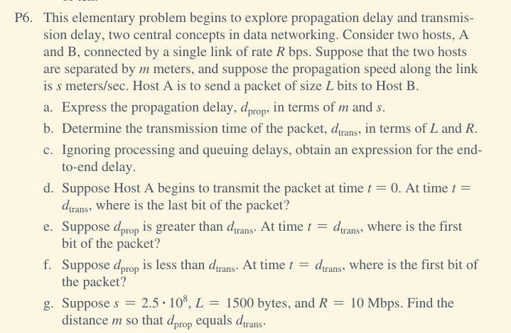
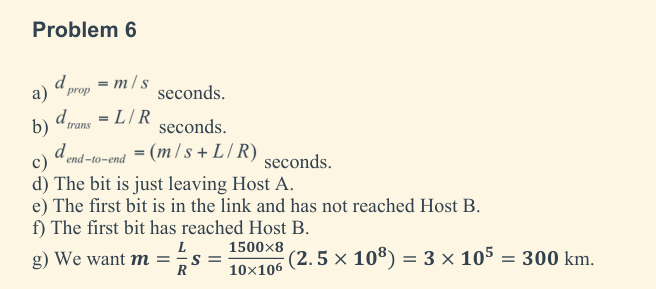
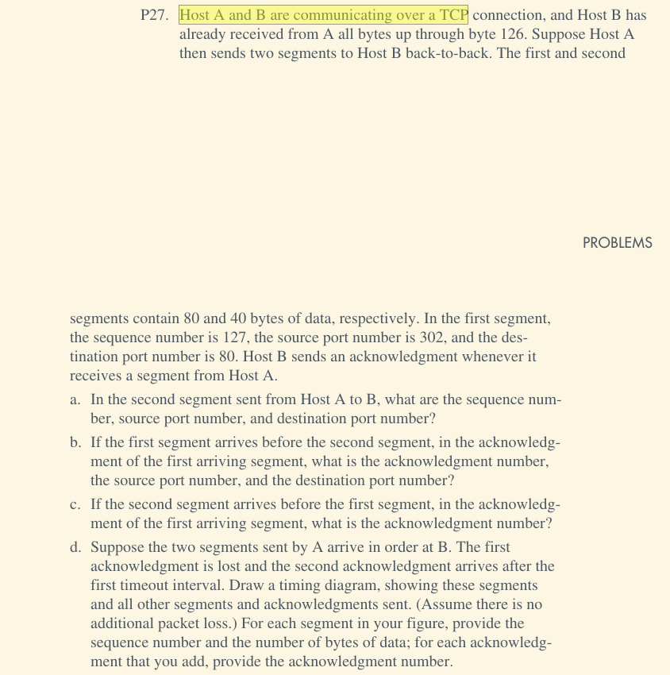
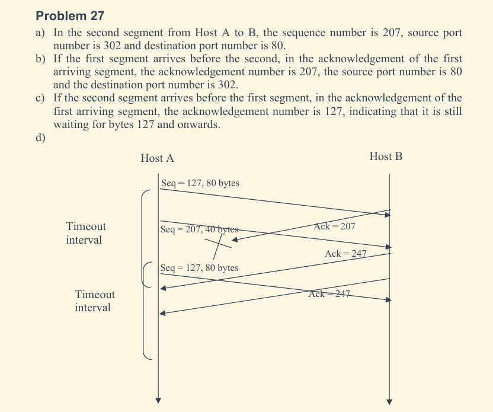
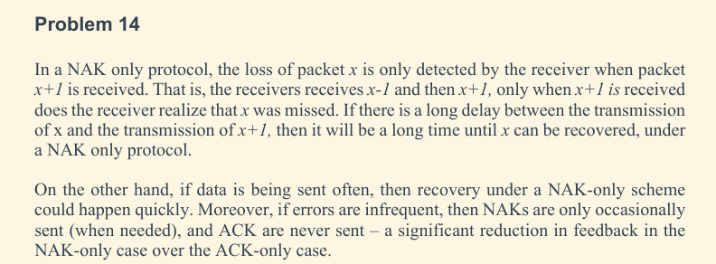

# Questions not already in other documents

## Mid Sem

3. b.

```text
Consider a short, 10-meter link, over which a sender can transmit at a rate of 150 bits/sec 
in both directions. Suppose that packets containing data are 100,000 bits long, and packets 
containing only control (e.g., ACK or handshaking) are 200 bits long. Assume that N parallel 
connections each get 1/N of the link bandwidth. Now consider the HTTP protocol, and suppose 
that each downloaded object is 100 Kbits long, and that the initial downloaded object contains 
10 referenced objects from the same sender. Would parallel downloads via parallel instances 
of non-persistent HTTP make sense in this case? Now consider persistent HTTP. Do you expect 
significant gains over the  non-persistent case? Justify and explain your answer.
```

Kurose UNIT 2 P 10

```text
Note that each downloaded object can be completely put into one data packet. Let Tp
denote the one-way propagation delay between the client and the server.
First consider parallel downloads using non-persistent connections. Parallel downloads
would allow 10 connections to share the 150 bits/sec bandwidth, giving each just 15
bits/sec. Thus, the total time needed to receive all objects is given by:
(200/150+Tp + 200/150 +Tp + 200/150+Tp + 100,000/150+ Tp )
+ (200/(150/10)+Tp + 200/(150/10) +Tp + 200/(150/10)+Tp + 100,000/(150/10)+ Tp )
= 7377 + 8*Tp (seconds)
Now consider a persistent HTTP connection. The total time needed is given by:
(200/150+Tp + 200/150 +Tp + 200/150+Tp + 100,000/150+ Tp )
+ 10*(200/150+Tp + 100,000/150+ Tp )
=7351 + 24*Tp (seconds)
Assuming the speed of light is 300*106 m/sec, then Tp=10/(300*106)=0.03 microsec. Tp
is therefore negligible compared with transmission delay.
Thus, we see that persistent HTTP is not significantly faster (less than 1 percent) than the
non-persistent case with parallel download.
```

4. a

```text
Can a machine with a single DNS name have multiple IP" addresses ?
How could this occur ?
DNS uses UDP instead of TCP. Ifa DNS packet is lost, there is no automatic recovery. Does this cause a problem, and ir
so, how is it solved ? 
Can a computer have two DNS names that fall in
different top-level domains ? If so, give a plausible example. If not,
explain why not ?
```

```text
Yes. In fact, in Fig. 7-3 we see an example of a duplicate IP address.
Remember that an IP address consists of a network number and a host
number. If a machine has two Ethernet cards, it can be on two separate net-
works, and if so, it needs two IP addresses.

DNS is idempotent. Operations can be repeated without harm. When a pro-
cess makes a DNS request, it starts a timer. If the timer expires, it just makes
the request again. No harm is done.

It is possible. www.large-bank.com and www.large-bank.ny.us could have
the same IP address. Thus, an entry under com and under one of the country
domains is certainly possible (and common).
```

5. a.

```text
It is desired to send a sequence of computer screen images over an optical fiber. The screen is 480 x
640 pixels, each pixel being 24 bits. There are 60 screen images per second. How much bandwidth is
needed?
```

```text
The data rate is 480 × 640 × 24 × 60 bps, which is 442 Mbps.
```

5. b.

```text
Suppose Host A sends two TCP segments back to back to Host B over a
TCP connection. The first segment has sequence number 90; the second has
sequence number 110.
a. How much data is in the first segment?
b. Suppose that the first segment is lost but the second segment arrives at B. In the acknowledgment that 
Host B sends to Host A, what will be the acknowledgment number?
```

```text
a) 20 bytes
b) ack number = 90
```

## End Sem

2. a




2. b




3. a. i

```text
Consider a reliable data transfer protocol that uses only negative acknowledg-
ments. Suppose the sender sends data only infrequently. Would a NAK-only
protocol be preferable to a protocol that uses ACKs? Why? Now suppose the
sender has a lot of data to send and the end-to-end connection experiences
few losses. In this second case, would a NAK-only protocol be preferable to
a protocol that uses ACKs? Why?
```



