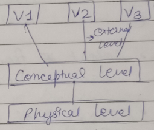
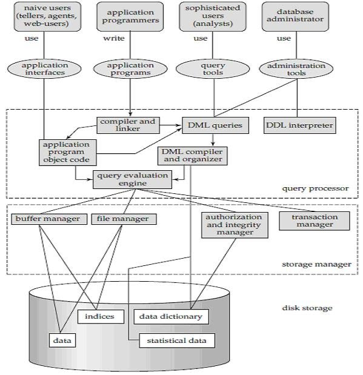

# UNIT 1: Introduction to DBMS

## DB

- coll. of interrelated data _ performed particular task on them
- Implicit prop.:
  - represent ascepts of real world
  - logicallt coherent coll. of data with some inherent meaning (no random stuff)
  - designed, built and populated for specific purpose.

## DBMS

- coll. of prog. _ enable users to create & maintain a db.
- general purpose S/W _ facilitates proc. of defining, building, and manipulating db for various app.
  - defining: specifying datatype, strcuture & contraints for data to be stored in db.
  - building/constructing: storing data on some storage medium.
  - manipulating: funcs. as query db, retrieve specific data, updating data & making rerports from data.

## Characteristics of db

1. Self describing nature of db
2. Insulation of data & program (Data Abstraction)
3. Support multiple views of data
4. Sharing of data / multiuser env.

- Self describing nature of db:
  - not only contains data but aso complete desc. of db struct & constraints.
  - all these definitions stored in data dictionary _ updated automatically & contains info of each file - datatype & contraints of each data item

- Insulation of data & program (Data Abstraction):
  - no need to know how data stored.
  - achieved via data models _ provides conceptual representation
  - models: heirarchical, network, relational, and Object oriented.

- Support multiple views of data:
  - db has many users, each of whom may require diff. view of db.
  - so depedning on what type of user using db, his ops. change.

- Sharing of data / multiuser env.
  - many users simultaneously can access and manipulate data.
  - ensure data consistency and prevent conflicts.
  - how? locking mechanism.
  - ensure changes by 1 user not lost due to actions of another user.

## Problems of File System

1. Data Redundancy & inconsistency
2. Difficulty in acessing data
3. Data Isolation
4. Integrity problem
5. Atomicity problems
6. Concurrent access anomalies
7. Security problem

- Data Redundancy & inconsistency:
  - Diff. files for diff. apps. _ duplicated data
  - wastage of storage

- Difficulty in acessing data:
  - data in many diff. locations.
  - not convinient and efficient

- Data Isolation:
  - same as above.
  - one modification in data structure cause problems in apps.

- Integrity Problems:
  - programmers code some stuff to check for correctness

- Atomicity Porblems:
  - if failure occurs, restore data prior to failure.
  - here, we write data simlutaneouslt to file, so kinda hard.

- Concurrent aceess anomalies:
  - multi user support for accessing, writing and modifying

- security problems:
  - unauthorized acces often

## Advantages of DB (Basically eliminate Cons of FS)

- Control Reduncancy
- Provide persistent storage for data & prog.
- multiuser interface
- backup & recovery mechanism
- Integrity Contraints
- Restrcit unauthorized access

## Users of DB

1. Database Administrators (DBA)
1. Database Designers
1. System Analysts
1. Application Programmers / Back-End Developers
1. Naive Users / Parametric Users
1. Sophisticated Users
1. Casual Users / Temporary Users

- DBA:
  - in db env, primary res. is db and secondary DBMS.
  - DBA manaage these.
  - Responsible for:
    - authorizing access
    - managing its usage
    - orgranising S/W & H/W res.
    - security
    - periodic back & recovery.

- DB designers
  - responsible for:
    - identifying data to be stored
    - choosing proper structure to represent & store data
    - communicate with users (understand req.) & design it

- End Users:
  - people who actually do stuff on the db (query, update and generate reports)
  1. Casual Endusers:
     - occassionally access db, but may need diff. data everytime
     - Ex. Mid lvl managers & occassional browsers.
  2. Naive / parametric users:
     - Majority
     - constantly query & update db using standard types of query called canned transactions.
     - Ex. fontdesk workers, data entry ops, clerks, & clients.
  3. Spohisticated Users:
     - Familiar with DBMS & know how to do stuff
     - Ex. Engineers, scientists, data analysts.
  4. Standalone Users:
     - maintain personal db _ using readymade prog, packages, menu based / GUI

- System Analyst
  - determines req. of end users
  - provides coordination b/w end users, application programmers & DB designers

- Application Programmers:
  - develop fontend prog, test them, debug them & provide functionalities to use db.

## Data Models

- Hierarchical model:
  - tree
  - single parent for each record.
  - Each record - multi childs, but each child only 1 parent
  - GOod for one-to-many relationship, but not flexible and shit for many-to-many.

- Network Model:
  - allows more complex relationships b/w data entities.
  - graph like structure.
  - multi parents and childs.
  - more flexible than heirar. but diffi. to manage and maintain.

- Relational Model:
  - Most widely used.
  - data organised into tables
  - each table represent an entity and each record repre. a record.
  - keys used to connect diff. tables.

- Object-relational Model (ORDBMS):
  - combine object-oriented and realtional
  - allow complex data objects in RDBMS
  - Here objects can be represented as tuples in table.
  - each can have attr. and attr, can be of diff. data types (including images, videos, audios, etc).
  - allow user defined data types, operators and functions.

## 3 schema architecture

- ANSI/SPARC arch
- framewrok for desgining and developing DBS
- divide db into 3 layers (data abstrac.) each with its own schema.

1. External Schema or View Level:
   - highest level of abstraction and represents user's view of data.
   - includes a set of user views _ define how data is shown to diff. cat. of users.
   - hides complexity of underlying db

2. Conceptual Schema or Logical Level:
    - represents the logical structure of entire db.
    - defines the relationships b/w entities, their attr., and the constraints on data.
    - independent of any specific physical storage device or data access method.

3. Internal Schema or Physical Level:
    - lowest level of abstraction and represents the physical storage structure of database on disk.
    - defines how data is physically stored, indexed, and retrieved.
    - dependent on the specific technology used for storage and data access.

## Mapping

- transforming data from one schema to another.
- data exists in physical/internal lvl.
- transform req. on external into conceptual into internal

## Data Independence

- can be explained via 3 schema arch.
- defined as capacity to change chema at 1 lvl of db, without having to change schema at next higher lvl.
- 2 types:

1. Logical Data Independence:

- capacity to change conceptual schema, without having to change external schema or app. prog.
- we may change conceptual sch. to expand db to add/remove constraint OR to enable/disable a constraint.

2. Physical data independence:

- capacity.... internal schema without ... conceptual schema.
- chages to internal sch. may needed to reorganize files OR create additional access struct. like index.

- data independece achieved because when schema changed at some lvl, only mapping b/w 2 lvl changed.

## Database Language

### DDL (data Definition Lang)

- after db design compl., db schemas expressed by special lang called DDL.
- this. also used to specify prop. of data (constraints).

TO BE CONTINUED

## Database Interface

### Menu based Interface for browsing

- present user with list of options - menus
- menus eliminate need for memorizing syntax of query lang.
- also called browsing interface - allows user to look through content in exploratory manner.

### Form based Interface

- displays form to user _ user can insert data, search relevent data, or delete required data.

### Graphical User Interface

- displays a schema to user in diagramatic form.
- most GUIs use pointing device to pick certain part of displayed diag. schema.

### Natural language Interface

- accept request written in ENGLISH (or some other lang.)
- useually has its own syntax & a set of reserced words.
- after writing a query, its interpreted, & then interface generates high lvl query & submit to DBMS for further processing.

### Interface for Naive Users

- naive users such as front desk workers, often have small set of op. they perform repeatedly.
- interface made to minimize keystrokes required for each request.

### Interface for DBA

- THIS include commands for creating accounts, setting system params, giving authorization & reorgranizing storage strcuture of DB.

## DBMS Structure Components

- DBMS partitioned into modules _ deals with each responsibilites of overall system.
- functional compo. divided in 2 parts: Query Processor AND Storage Manager.

### 1. Query Processor

- belps db sytem to simplify & provide easier access to data.
- includes:

1. DDL Interpretor:

   - interpretes DDL statements
   - record definitions in data dictionary

2. DML Compiler:

   - translates DML statements -> eval. plan having low lvl instruct.
   - A Query can usually be translated into >1 alt. eval. plan which give same results.
   - all the eval. plan passed to eval. engine.

3. Query Evaluation Engine:

   - do query optimization
   - i.e, picks up eval plan with lowest cost and execute query.

### 2. Storage Manager

- program _ provides interface b/w low lvl data stored in DB AND query submitted to system.
- includes

1. File Manager:

   - manages allocation of space on disk & ds used to represent info on disk

2. Buffer Manager:

   - responsible for fetching data from disk -> main mem, & deciding which data to cache.

3. Authorization & Integrity Manager:

   - test for satisfaction of integrity constraint & check authority of user trying to access data.

4. Transaction Manager:

   - resposonsible to ensure DB system remains in consistent state regardless of failure.

!!! note Notes

     sjdfjllkjljljlfsfsfd  
     dsfsfsfsfsdffdsfsdfdsfsdfs
     sfdfsfdf  dsfsfsfsdfdsfsdf