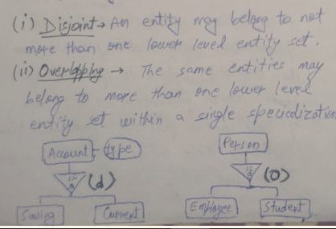

# UNIT 2: Relational and some stuff

## Relational Data Model

## Relational Data Model Concepts

NOT WORTH LEARNING FOR MID

## Properties of Relational DB

## Integrity Constraints

- way of implementing rules of DB
- restricts data that can be stored in relation
- helps us ensure INTEGRITY CORRECTNESS
- 4 types: Domain Integrity, Entity Integrity, Key, Referential

1. Domain Integrity Constraint

   - specify that value of each attribute A must be atomic value from domain(A) AND should be of same data type & format
   - data type includes String, Integer, Char, date, etc.

2. Entity Integrity Constraint

   - states that "no primary key value can be null".
   - because primary key used to id tuple in relation.
   - having null as prim. key -> we cant id some tuples.

3. Key Constraints

   - keys are entity set _ used to id an entiry within relation
   - relation can have mulitple key, among them 1 must be primary and only 1, which have unique AND not null values.

4. Referential Integrity Constraint

   - THIS specified b/w 2 relations.
   - used to maintain consistency among tuples of 2 relations
   - this rule concerned with FOREIGN key, i.e., attr. of relation having domain that is prim. key of another relation.
   - rule can be specified as follows

   

## Codd's Rule

1. Information Rule

   - All info in relational DB including table name, col name are represented by values in table.

2. Guaranteed Access Rule

   - Every piece of data in realtional DB can be accessed using COMBINATION of table name, col. name.

3. Systematic Treatment of Null Values

   - RDBMS handles records having unknown values (NULL vals) in predefined manner.

4. 5. 6. 7.

8. Physical Data Independence
9. Logical Data Independence

10. 11. 12.

## ER Model

- THIS perceives real world consisting of basic obj. called ENTITY, ATTR., and RELATIONSHIP among (us lul) those models.
- useful in mapping meanings & interaction of real world situation onto conceptual schema.
- use 3 basic notations: Entity set, Attr., and Relationship sets.

### Entity

- obj. in real world that is distinguishable from other obj.
- each entity has attr., i.e., the prop. that describes it.

### Entity Set

- set of entities of same type _ share same properties.

### Attibutes

- prop. used to descibe obj / entity.
- For each attr., there is set of permited vals called DOMAIN of attr.
- can be of following types:

1. Composite vs. Atomic (Simple) Attributes

   - Composite attr. can be divided into sub parts which repre. moe basic attr. with independent meaning. EX- student's full name, etc.
   - can form a heirarchy
   - value of THIS is concatenation of values of its constituents simple attr.
   - used to model situation _ user sometimes refer to THIS as whole but other times refer specificallt to its components

   - Simple attr. can't be further divided.
   - EX- Phone number.

2. Multivalued vs. SingleValued Attr.

   - Single valued - have single value for particaular entity
   - Ex- Aadhar Card no.

   - But some attr., have set of vals for specific entity - Multivalued attr.
   - THIS may have LOWER and UPPER bound to contraint no. of values. allowed.
   - EX- email add. (1 person can have >1).

3. Derived attr.

   - value of THIS cna be derived from value of other related attr.
   - ITS value not stored, rather computed when required.
   - EX- age can be derived from data_of_birth.

4. Null val

   - attr. take THIS when entity doesnt have any value for it.
   - i.e., NULL val indicates not applicable / unknown / something missing.

## realtion stuff

### Relationship

- association among several entities.
- relationsship set is set of relationship of same type.
- representeed by <>.

### Degree of realtionship

- no. of entities participating in relationship.
- EX- relationship with 2 entities = binary relationship, 3 = ternary, n = n-ary

### Role name

- each entity in relationship play particular role.
- THIS signifies what role it plays
- useful when entity participate in relationship >1 in different roles.
- here IT become vital.
- such relationships are called RECURSIVE RELATIONSHIP.

## Constraints on relationship type

1. Cardinality ratio

   - expresses no. of entites to which another entity can be associated with.
   - ASSUME 2 entities

     1. One - ONE:

        1. ent. in A -> only 1 ent. in B and vice versa.
        2. 

     

2. Paritcipation Constraints

   - specifies existence of ent. when its related to another entity in relationship.

   

## KEY

- attr. / set of attr. _ helps in uniquely id rows of table.
- can be types: SUPER, CANDIDATE, PRIMARY, ALTERNATE, FOREIGN

1. SUPER KEY

   - combination of all possible atttr. _ which can uniquely id rows in table.
   - can have EXTRA attr. not needed to uniquely id rows.
   - EX- FOR KEYS = Roll no., Name, reg. no.
   - so possible combinaations is power set of these. except null.

2. CANDIDATE KEY

   - minimal SUPER key with NO REDUNDANT attr,
   - called ↑ , because we select CAND. from set of SUPER, such that minimum attr. needed to id rows.
   - 

3. PRIMARY KEY

   - minimal set of attr. _ which uniquely id rows.
   - selected from CANDIDATE KEY by DBA.

4. ALTERNATE KEY

   - CANDIATE KEYS - PRIMARY KEY. (- is minus)
   - 

A FOREIGN KEY is a field (or collection of fields) in one table, that refers to the PRIMARY KEY in another table.

## Strong & Weak Entity

- Strong - ent. having sufficient attr. _ which can used as CANDIDATE KEY
- WEAK - opposite of ↑, and depends on another entity for their existence.
- ↑ id'ed with another entity set -> identifying entity set
- every weak MUST BE ASSOCIATED with an identifying entity and such relationship = identifying relationship

## Extended ER

### Specialization and Generalization

### Constraints on specialization and genr

1. Condition defined OR Attr. defined

   - whether subclass / lower lvl entity satisfy EXPLICIT condition
   - 

2. User Defined

   - not constrained by membership condition
   - user defined constraint.
   - 

   - a second type of contraint... based on belonging.
   - DISJOINT AND OVERLAPPING

   

3. Completedness Constraint

   

## AGGREGATION

- ER DIAG CANT EXPRESS RELATIONSHIP AMONG RELATIONSHIP
- USE AGGREGATION
- THIS is an abstraction where relationship are treated as higher lvl entity.
- can establish BINARY relation.

