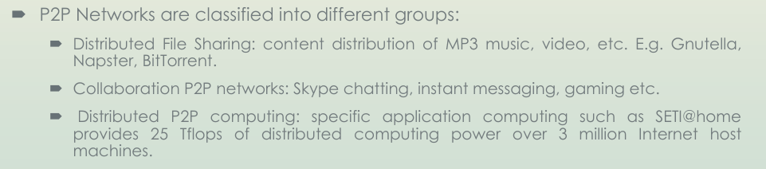

# UNIT 1: Introduction

## System Models for Distributed and Cloud Computing (for scalable computing over  internet)

- Distributed and cloud computing systems are built over a large number of autonomous computer nodes.
- these node machines interconnected by SAN, LAN or WAN.
- nowadays, LAN switches connect 100s of machines as working cluster
- and WAN can connect these local clusters to form MEGA HUMONGOUS GIGANTIC cluster of clusters
- MASSIVE systems considered highly scalable, _ reach web scale connectivity,
- THESE classified into 4 groups: clusters, peer-to-peer networks, grids, and clouds.

1. Clusters:

   - distributed systems cluster _ group of machines \_ virtually / geographically separated and work together to provide the same service to clients.
   - possible that many of the services you run in your network today are part of a distributed systems Cluster Distributed Services:
     - Domain Naming System
     - Windows Internet Naming Service
     - Active Directory

2. P2P Nwetworks (basically everything good torrenting):

   - every node acts as both a client and a server, providing part of the system resources
   - Peer machines are simply client computers connected to the Internet
   - all client machines can join and leave freely
   - NO master-slave relationship among peers.
   - NO central db needed.
   - Distributed, sself organising
   - 

3. Computing Grids:

   - This is the use of widely distributed computer resources to reach a common goal.
   - Grids are heterogeneous clusters interconnected by high-speed networks.
   - They have centralized control, are server- oriented.
   - suited to distribute supercomputing. E.g. TeraGrid
   - The computers used in a grid include servers, clusters, and supercomputers. PCs, laptops, and mobile devices can be used to access a grid system.

4. Cloud:

   - pool of virtualized computer resources
   - leverages its low cost and simplicity to benefit both users and providers
   - Machine virtualization has enabled such cost-effectiveness.
   - monitor usage real time
   - IMP POINT: these cloud sys., given access to user (paid mostly), already provisioned H/W & S/W, storage, network, and other services.

## Technologies for Network based systems

BASICALLY WRITE HOW ADVANCEMENT IN FOLLOWING THINGS HAPPENED. LIKE MEMORY 16KB EXP IN PAST, NOW 8 GB CHEAP.

- Multi-core CPUs and Multithreading Technologie
- many core GPU
- GPU computing
- Memory, Storage, WAN
- virtual machines

## SOFTWARE ENVIRONMENTS FOR DISTRIBUTED SYSTEMS AND CLOUDS

JUST SOA (service oriented architecture)

- architectural approach in which applications make use of services available in the network
- services are provided to form applications, through a network call over the internet
- Each service in SOA is a complete business function in itself
- services are published in such a way that it makes it easy for the developers to assemble their apps using those services

There are two major roles within Service-oriented Architecture:

1. Service provider:

- The service provider is the maintainer of the service and the organization
- To advertise services, the provider can publish them in a registry, together with a service contract that specifies the nature of the service, how to use it, the requirements for the service, and the fees charged.

2. Service consumer:

- The service consumer can locate the service metadata in the registry and develop the required client components to bind and use the service.

Advantages of SOA:

- Service reusability
- Availability
- Scalability
- Reliability
- Easy maintenance
- Platform independent

Applications:

- situational awareness sys. - army
- improve healtcare delivery
- usage of inbuilt GPS functionality in phone for apps.

## Cloud computing Fundamentals

### Brief history of cloud computing

FUCK IT

CLOUD COMPUTING

- NIST - "a model for enabling ubiquitous, convenient, on-demand network access to a shared pool of configurable computing resources (e.g., networks, servers, storage, applications, and services) that can be rapidly provisioned and released with minimal management effort or service provider interaction."

- model for delivering on-demand computing resources over the internet
- allows users to access a shared pool of computing resources, including servers, storage, applications, and services, that can be rapidly provisioned and released with minimal management effort or service provider interaction.
- typically offered through three service models: Infrastructure as a Service (IaaS), Platform as a Service (PaaS), and Software as a Service (SaaS).
- EXPLAIN THEM

ADVANTAGES:

- Scalability
- Flexibility
- Cost savings
- Reliability
- Security: access controls, encryption, and monitoring, to protect user data and applications.

DISADVANTAGES:

- Security and privacy concerns: Cloud computing raises concerns about the security and privacy of user data, as it is stored on remote servers that are managed by third-party providers.
- Vendor lock-in: Cloud computing can create a dependency on a single provider, making it difficult to switch providers or migrate to a different computing environment.
- Downtime and service disruptions:
- Limited control:
- Internet connectivity: Need high speed internet mostly

## Essential characteristics of cloud computing model

5

1. On Demand Self service:

   - allows users to provision computing resources, such as servers, storage, and applications, on-demand without requiring human interaction with the service provider.
   - enables users to quickly and easily access the resources they need, without the need for manual intervention.

2. Broad network access:

   - resources can be accessed over the internet from a variety of devices, including desktops, laptops, tablets, and smartphones
   - enables users to access computing resources from anywhere with an internet connection, making it ideal for remote work and collaboration.

3. Resource pooling:

   - Cloud providers can pool computing resources to serve multiple users, with different physical and virtual resources dynamically assigned and reassigned according to user demand.
   - enables cloud providers to optimize resource utilization and reduce costs, while providing users with flexible and scalable computing resources.

4. Rapid elasticity:

   - resources can be rapidly scaled up or down to meet changing user demand
   - only pay what need.
   - enables users to quickly and easily adjust their computing resources to match their business needs, without the need for significant capital investment in hardware or infrastructure.

5. Measured service:

   - monitor and measure resource usage, allowing users to be billed for only the resources they consume.
   - enables users to accurately track their computing costs and optimize their resource usage, while providing cloud providers with a predictable revenue stream.

