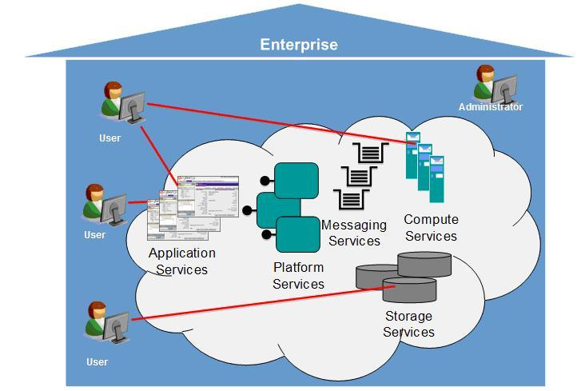
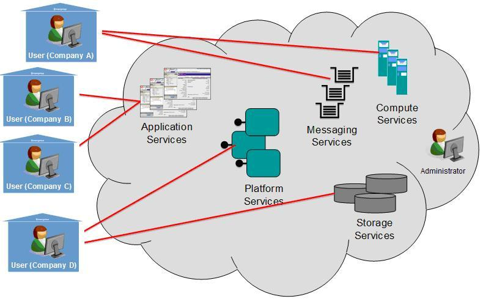
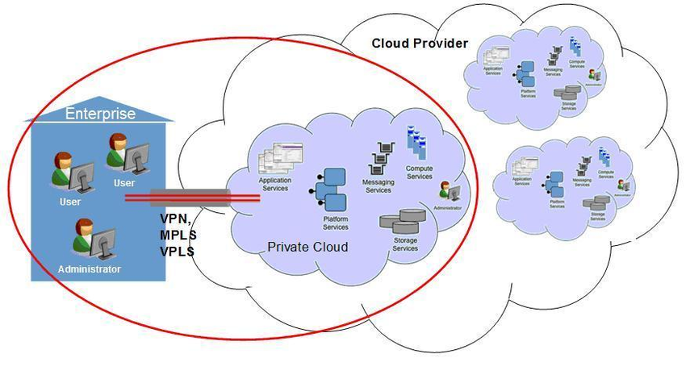
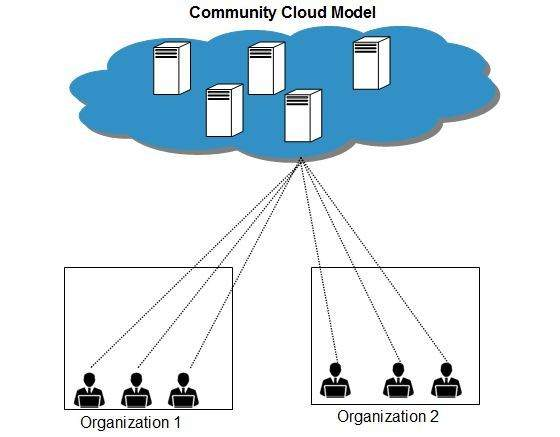
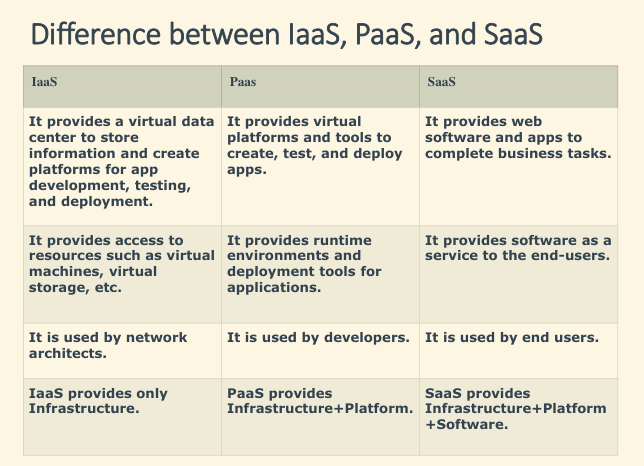

# UNIT 2: Cloud Platform Architecture

## Architectural Design of Compute and Storage Clouds

The architectural design of compute and storage clouds typically involves

- a distributed system of servers and storage devices that are interconnected to provide scalable and reliable computing and storage resources.

### Here are some key elements of the architectural design of compute and storage clouds

- Virtualization: Compute and storage clouds typically use virtualization technologies to abstract physical resources and create virtual resources that can be dynamically allocated to users based on demand.

- Resource management: Cloud providers use resource management software to allocate and manage computing and storage resources across multiple servers and storage devices.

- Load balancing: Load balancing software is used to distribute workloads across multiple servers to ensure that resources are used efficiently and to prevent overloading of individual servers.

- Redundancy: Compute and storage clouds typically use redundant hardware and software to ensure high availability and fault tolerance. This includes replicating data and applications across multiple servers and storage devices.

- Network connectivity: Compute and storage clouds require high-speed network connectivity to ensure that data can be transferred quickly and efficiently between servers and storage devices.

- Security: Compute and storage clouds require robust security measures to protect user data and applications. This includes access controls, encryption, and monitoring.

- APIs: Compute and storage clouds typically provide APIs that allow users to programmatically access and manage computing and storage resources.

## Enabling Technologies for Clouds

1. Fast Platform Deployment: Fast platform deployment refers to the ability to quickly and easily deploy software platforms, applications, and services. This is typically achieved through the use of automation tools and cloud-based infrastructure, which allow for rapid provisioning and scaling of resources.

1. Virtual clusters on demand: Virtual clusters on demand refer to the ability to create and manage virtual clusters of computing resources as needed. This allows for greater flexibility and scalability in managing workloads, as resources can be easily added or removed as needed.

1. Multitenant Techniques: Multitenant techniques refer to the ability to support multiple tenants or users on a single software platform or infrastructure. This is typically achieved through the use of virtualization and containerization technologies, which allow for the isolation and management of multiple user environments.

1. Massive Data Processing: Massive data processing refers to the ability to process and analyze large volumes of data quickly and efficiently. This is typically achieved through the use of distributed computing and parallel processing techniques, which allow for the processing of data across multiple nodes or clusters.

1. Web-Scale Communications: Web-scale communications refer to the ability to support large-scale communication and collaboration across distributed teams and organizations. This is typically achieved through the use of cloud-based communication and collaboration tools, which allow for real-time communication and collaboration across geographically dispersed teams.

1. Distributed Storage: Distributed storage refers to the ability to store and manage data across multiple nodes or clusters. This allows for greater scalability and reliability in managing large volumes of data, as data can be easily replicated and distributed across multiple nodes.

1. Licensing and Billing services: Licensing and billing services refer to the ability to manage and track software licenses and billing for cloud-based services. This is typically achieved through the use of automated billing and licensing tools, which allow for the tracking and management of usage and billing across multiple users and tenants.

## Deployement models

EXAMPLEEEEEEEEEEEEEEEESSSSSSSSSSSSSSSS

### 1. Private Cloud

- cloud-based infrastructure used by stand-alone organizations.
- offers great control over security.
- data is backed up by a firewall and internally, and can be hosted internally or externally.
- PERFECT FOR: high security requirements, high management demands, and availability requirements

BENEFITS:

- High Security and Privacy
- More Control
- Cost and Energy Efficiency
- Reliable

CONS:

- Restricted Area of Operation
- High Priced
- Limited Scalability
- Additional Skills

### 2. Public Cloud

- provided on a network for public use
- Customers have no control over the location of the infrastructure
- based on a shared cost model for all the users, OR in the form of a licensing policy such as pay per user.
- PERFECT FOR: orgs. with growing and fluctuating demands, storasge of non-sensitive data, webmail.

BENEFITS:

- Cost Effective
- Reliability
- Flexibility
- Location Independence
- Utility Style Costing
- High Scalability

CONS:

- Low Security
- Less Customizable

## 3. Hybrid Cloud

- incorporates the best of both private and public clouds, but each can remain as separate entities.
- the internal, or external providers can provide resources.
- PERFECT FOR: scalability, flexibility, and security. ORG. strogin data using private and interacting with user using public.

BENEFITS:

- Scalability
- Flexibility
- Cost Efficiency
- Security

CONS:

- Networking Issues
- Security Compliance
- Infrastructure Dependency

## 4. Community Cloud

- mutually shared model between organizations _ belong to a particular community such as banks, government organizations, or commercial enterprises
- Community members generally share similar issues of privacy, performance, and security.
- Managed and hosted: Internally OR by 3rd-party vendor

BENEFITS:

- Cost Effective
- Sharing Among Organizations
- Security

CONS:

- Since all data is located at one place, one must be careful in storing data in community cloud because it might be accessible
to others.
- It is also challenging to allocate responsibilities of governance, security and cost among organizations.

## Cloud Service Models

### 1. SaaS (on-demand software)

- offers applications that are accessed over the web and are not managed by your company, but by the software provider.
- relieves your organization from the constant pressure of software maintenance, infrastructure management, network security, data availability, and all the other operational issues involved with keeping applications up and running.
- billing is typically based on factors such as number of users, usage time, amount of data stored, and number of transactions processed.
- EXAMPLE: dropbox, salesforce, slack.

CHARACTERISTICS:

- Managed from a central location
- Hosted on a remote server
- Accessible over the internet
- Users are not responsible for hardware and software updates. Updates are applied automatically.
- The services are purchased on the pay-as-per-use basis

### 2. IaaS

- offers a standardized way of acquiring computing capabilities on demand and over the web.
- resources include networks, processing power, VPS
- customers dont manage infrastructure, provider responsibility for availability.
- "pay as you go" - billed on how much storage you use or the amount of processing power you consume
- EXAMPLE: AWS, microsoft Azure, GCE (google compute engine)

CHARACTERISTICS:

- Resources are available as a service
- Services are highly scalable
- Dynamic and flexible
- GUI and API-based access
- Automated administrative tasks

### 3. PaaS

- halfway b/w SaaS and IaaS.
- offers access to a cloud-based environment in which users can build and deliver applications without the need of installing and working with IDEs
- users can often customize the features they want included with their subscription.
- EXAMPLE: Heroku, Google App Engine (GAE), Windows Azure??? lol.

CHARACTERISTICS:

- Accessible to various users via the same development application.
- Integrates with web services and databases.
- Builds on virtualization technology, so resources can easily be scaled up or down as per the organization's need.
- Support multiple languages and frameworks.
- Provides an ability to "Auto-scale".
