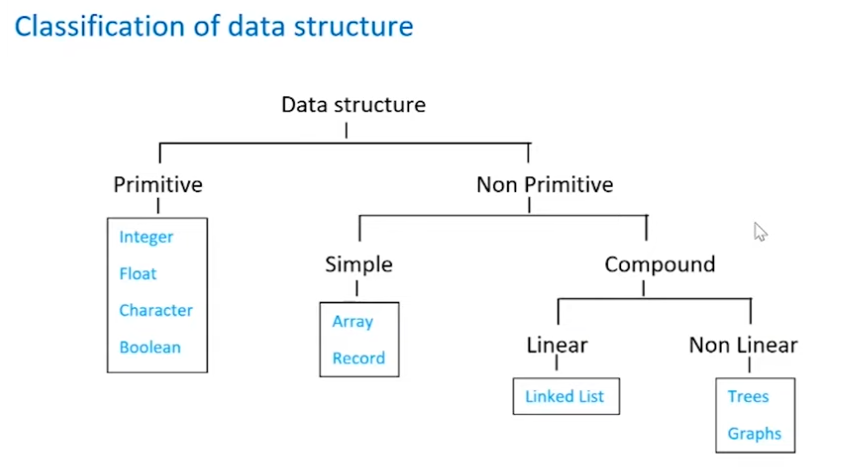

# DS

## DATA STRUCTURE

- way of org data in mem _ so that can be used efficiently
- 2 PARTS:
  1. how data org in mem
  2. what ops can be performed

## Classification of ds

## ADT

- conceptual/mathematical model _ specifies diff. ops on that data type.
- doesnt specify how those ops implemented though.
- y called abstract??
  - cause of 2nd point
  - 2nd point is the concept of abstraction.
- EX- Stack, Q, List.
- OPS:
  1. Push
  2. Pop
  3. Display
  4. Peek

## Stack

- ADT _ LIFO basis.
- ele. pushed to the top.
- Applications:
  1. converting infix to postfix
  2. evaluating postfix exp
  3. reverse string
  4. parenthesis validation
  5. backtracking